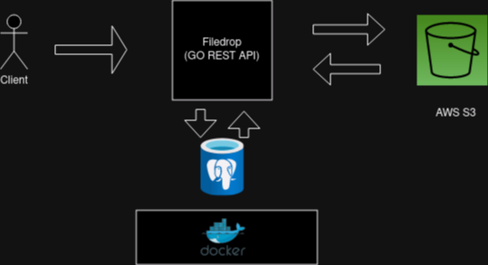

Filedrop
=============
Upload and Download Files


Table of Contents
-----------------

-   [Project Background](#project-background)
-   [Install & Setup](#install-&-setup)
-   [Usage](#usage)
-   [Authors](#authors)
-   [License](#license)


Project Background
----------
Architecture:
<br>

<br>

File saving service. Users can save and download their files and even make them available to other people, either publicly or through pre-designated access.

Install & Setup
---------------
```html 
git clone https://github.com/ccallazans/filedrop.git
cd filedrop
docker compose up -d
make migrate-up
make run
```
Edit and rename .env-local to .env and fill with credentials
```
DATABASE_URL= "database connection"

AWS_ACCESS_KEY_ID= "aws access key id"
AWS_SECRET_ACCESS_KEY= "aws secret access key"
AWS_REGION= "aws region"
AWS_BUCKET= "aws bucket name"

JWT_SIGNING_KEY= "jwt signing key"

APP_URL= "url of application"
```
App runs on:
```
localhost:8080
```

Usage
-----

[EDIT WITH OPEN API]

License
-------

[MIT License](LICENSE)
